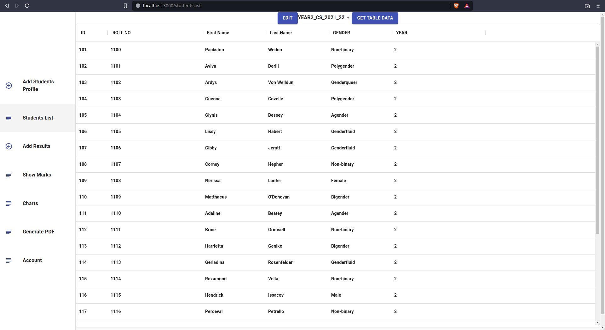
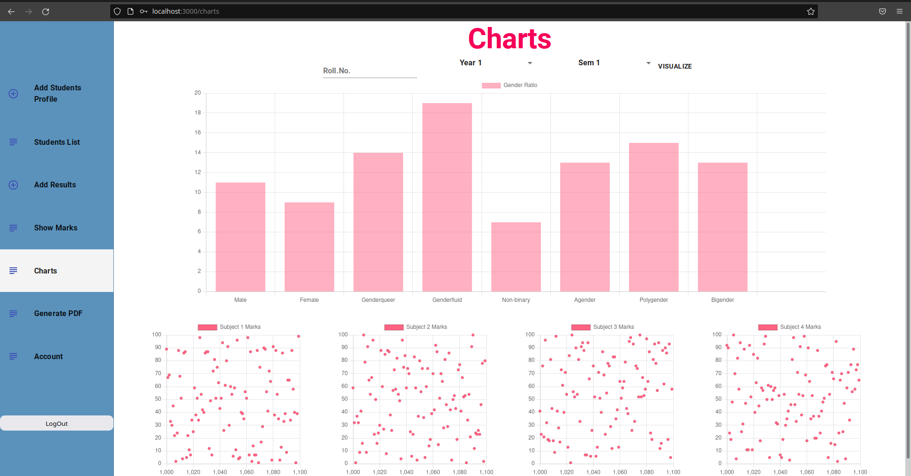

# Resultify
## (A full stack app used to manage students’ results)

### This app helps to manage the students' List as well as their results.

### It can also help us to visualize Students Semester wise performance with the help of Graph.

### Tech Used :

- ## Front End : React , Material UI for styling
    
- ## Back End : Express
    
- ## Database : PostgreSQL
    

There are 5 section to this.

1.  Add Student Profile
    - Which added Students Details like Name, Roll.No etc. to the local Database
    -  
2.  Students List
    - It shows the Students List added in above which is fetched from local database
    - [All the information here is just for demo purpose]
    - 
3.  Add Results
    - Add Students Results via CSV File
    - You have to just input the CSV file path, the types of columns, and name for table name
    - 
4.  Show Results
    - Show the marks of Students added via above step. For demo purposes ii is already in the database
    - 
5.  Charts
    - You can select Roll.No of student from dropdown menu to get the Line Chart for students' performance for all 4 Semesters
    - 
